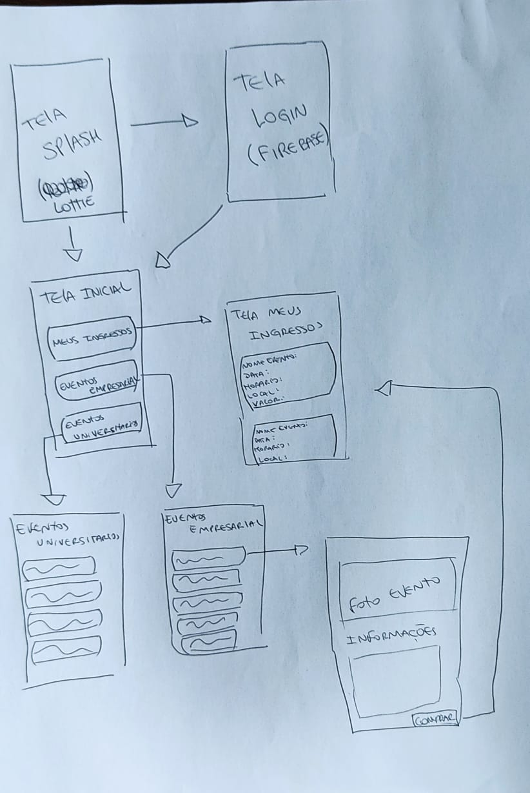
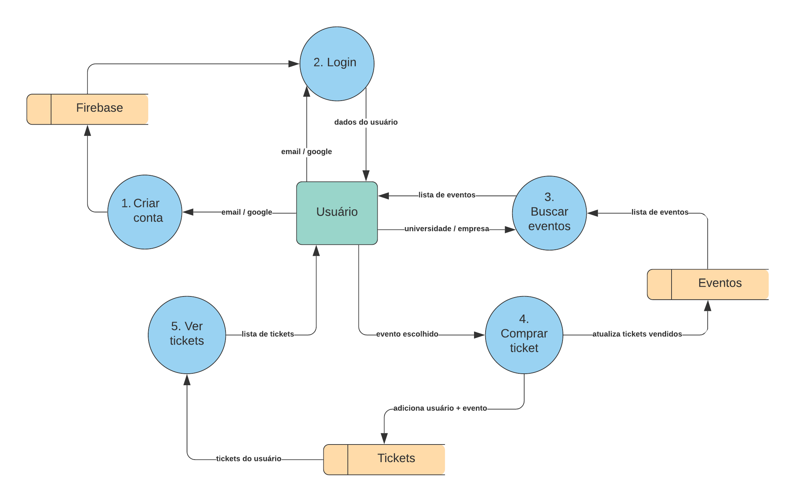

# Desafio_MB

App desenvolvido em forma de desafio para concorrer uma vaga de **Desenvolvedor Android Júnior** para **MB Labs**.

O app tem como objetivo buscar eventos empresariais e universitários e efetuar compra. Para acessar o app é necessário fazer um login com o e-mail ou utilizando o Google, podendo assim ver os ingressos comprados na tela *Meus Ingressos*.

 - O fluxo de login foi feito com `Firebase` usando o `FirebaseAuth`
 - Todos os dados mostrados no app(meus eventos, meus ingressos e forma de pagamento) são fake e gerados no código fonte.
 - Para a animação de Splash foi usado o [Lottie](https://airbnb.design/lottie/)
 - Para carregar a imagem do usuário foi usado o [Glide](https://github.com/bumptech/glide)

### Desenho Inicial

### Fluxo do Sistema

---
Criado por [Rafael Neves](https://github.com/NevesRafa)